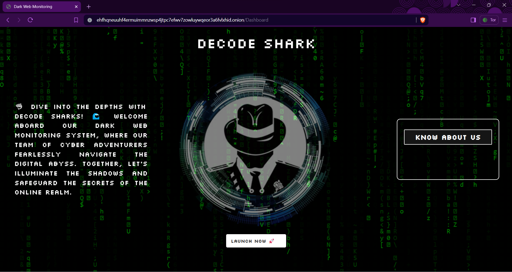

# CybersecBattel-Hackathon-

## Team Name 

**Decode Shark**

## Team Members

- Swopna Sarit Barik
- Abinash Nanda
- Rahul Mohapatra

## About-Us
We, the students of **CV Raman Global University, Bhubaneswar** have developed a sophisticated Dark Web Monitoring Tool for multifaceted purposes. With a commitment to innovation and excellence, our team endeavors to address cybersecurity challenges effectively, offering comprehensive solutions tailored to diverse needs.

**Mission Statement: Unveiling the Dark Web**

In our relentless pursuit of digital transparency and security, our mission is to illuminate the obscure corners of the Dark Web, unveiling its secrets and empowering individuals and organizations with actionable insights. Through innovative technologies and unwavering dedication, we strive to demystify the complexities of the Dark Web, enabling proactive measures against illicit activities and fostering a safer online environment for all.

**Problem Statement: Dark Web Monitoring**

Dark Web Monitoring is a critical aspect of cybersecurity, focusing on tracking illegal activities, and safeguarding against potential threats lurking in the hidden corners of the internet.

## Preview

**Features of our tool:**

1. **Dark Web Hosting and Onion Address Generation**
   - Enables secure hosting on the Dark Web.
   - Provides seamless generation of unique onion addresses.
   - Ensures anonymity and privacy for users.

2. **User-Friendly GUI and CLI**
   - Offers a graphical interface for easy navigation.
   - Command-line interface for advanced users.
   - Simplifies the monitoring process for all skill levels.

3. **Comprehensive Dark Web Scraper and Crawler**
   - Gathers data from onion sites using specified keywords.
   - Monitors keywords associated with illegal activities.
   - Alerts relevant onion sites in real-time.

**Trend Analytics of Illegal Activities:**

1. **Insightful Trends Analysis**
   - Identifies emerging patterns and trends in dark web activities.
   - Provides valuable insights into evolving threats.
   - Enables proactive measures against potential risks.

**Automated OSINT and Recon on Target Dark Webs:**

1. **Fully Automated Intelligence Gathering**
   - Streamlines the collection of information on target dark webs.
   - Provides comprehensive OSINT reports automatically.
   - Enhances efficiency and accuracy in reconnaissance efforts.
